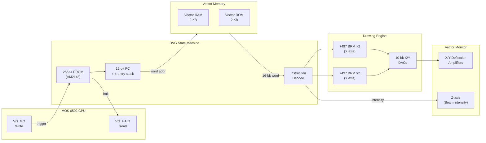
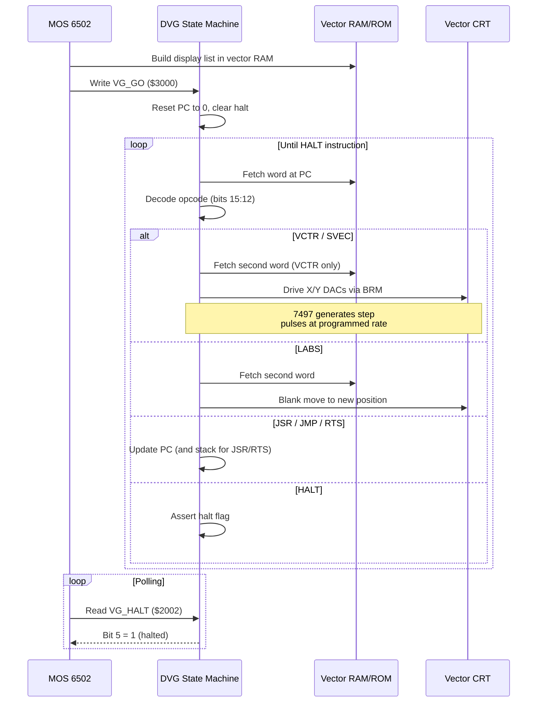

# Atari Digital Vector Generator (DVG)

State-machine vector graphics coprocessor (1979, Atari Inc.) used in Atari's first-generation vector arcade boards. Reads 16-bit instruction words from shared vector RAM/ROM and drives X/Y deflection amplifiers on a vector CRT monitor, drawing lines and dots at programmable brightness. The DVG is not a single IC but a discrete state machine built from a 256x4-bit bipolar PROM (AM2148/82S137), a pair of cascaded 7497 Bit Rate Multiplier ICs per axis, and supporting TTL logic on the main PCB.

Used in Lunar Lander (1979), Asteroids (1979), and Asteroids Deluxe (1980).

## CPU Interface

The DVG occupies two addresses in the host CPU's memory map. All other communication happens through shared vector RAM.

| Address | Name | Direction | Description |
| ------- | ---- | --------- | ----------- |
| $3000 | VG_GO | Write | Triggers DVG execution: resets PC to 0, clears halt flag |
| $2002 | VG_HALT | Read | Bit 5: 1 = DVG halted (idle), 0 = DVG running |

The CPU builds a display list in vector RAM each frame, writes to VG_GO, then polls VG_HALT to know when drawing is complete before swapping buffers.

## Memory Map

The DVG addresses a 4 KB (2048 x 16-bit word) vector memory space:

| Byte Range | Word Range | Size | Contents |
| ---------- | ---------- | ---- | -------- |
| $0000-$07FF | 0-1023 | 2 KB | Vector RAM (CPU-writable display list) |
| $0800-$0FFF | 1024-2047 | 2 KB | Vector ROM (fixed subroutines: characters, shapes) |

Words are little-endian: the low byte at `word_addr * 2`, the high byte at `word_addr * 2 + 1`. The DVG always starts execution at word address 0.

## Instruction Set

Instructions are decoded from bits 15:12 of the first word. Two-word instructions read the second word at PC+1.

| Opcode (15:12) | Mnemonic | Words | Format |
| -------------- | -------- | ----- | ------ |
| 0x0-0x9 | VCTR | 2 | Draw vector with per-vector scale offset |
| 0xA | LABS | 2 | Load absolute beam position and global scale |
| 0xB | HALT | 1 | Stop DVG execution |
| 0xC | JSR | 1 | Push return address, jump to subroutine |
| 0xD | RTS | 1 | Pop return address from stack |
| 0xE | JMP | 1 | Unconditional jump (no stack push) |
| 0xF | SVEC | 1 | Draw short vector (compact encoding) |

### VCTR (opcodes 0x0-0x9)

Draw a vector with direction, magnitude, and per-vector scale adjustment.

```text
Word 0:  [op:4 | dy:12]
Word 1:  [intensity:4 | dx:12]
```

The 4-bit opcode field (0-9) doubles as a scale offset added to the global scale factor. DX and DY are 12-bit values where bit 10 encodes direction (0 = positive, 1 = negative) and the remaining bits feed the rate multiplier. Intensity 0 produces a blank (invisible) move.

### LABS (opcode 0xA)

Load absolute beam position, reset global scale, and set intensity.

```text
Word 0:  [0xA:4 | y:12]
Word 1:  [intensity:4 | x:12]
```

Sets the beam to (X, Y), loads the global scale factor from the intensity nibble, and sets the current intensity. Typically the first instruction in each frame's display list.

### HALT (opcode 0xB)

```text
Word 0:  [0xB:4 | (unused):12]
```

Stops DVG execution and asserts the VG_HALT status bit. The CPU detects this by polling the status register.

### JSR (opcode 0xC)

```text
Word 0:  [0xC:4 | target:12]
```

Pushes the next PC onto the 4-entry hardware stack and jumps to the target word address. The stack pointer wraps modulo 4 — there is no overflow detection.

### RTS (opcode 0xD)

```text
Word 0:  [0xD:4 | (unused):12]
```

Pops the return address from the hardware stack and resumes execution there.

### JMP (opcode 0xE)

```text
Word 0:  [0xE:4 | target:12]
```

Unconditional jump to the target word address. Does not modify the stack.

### SVEC (opcode 0xF)

Draw a short vector using a compact single-word encoding.

```text
Word 0:  [0xF:4 | dy_hi:4 | intensity:4 | dx_hi:4]
```

Only the upper 4 bits (11:8) of DX and DY are encoded; bits 7:0 are implicitly zero. The scale offset is derived from the sign bits of DX and DY, yielding an additional 2-5 added to the global scale. This instruction is used for short line segments (e.g., character strokes in the vector ROM font).

## Architecture

### Block Diagram



### Execution Sequence



### Clock and Timing

The DVG state machine is clocked at 1.5 MHz (derived from the system 12.096 MHz crystal divided by 8). Each state machine step processes one clock cycle, with vector drawing taking a variable number of cycles depending on the scale factor.

| Clock | Frequency | Derivation | Purpose |
| ----- | --------- | ---------- | ------- |
| Master | 12.096 MHz | Crystal oscillator | System clock |
| DVG | 1.5 MHz | Master / 8 | State machine and BRM clock |

### 7497 Bit Rate Multiplier

The 7497 is a 6-bit binary rate multiplier that generates output pulses at a programmable fraction of the input clock rate. Two 7497s are cascaded per axis to form a 12-bit multiplier, producing step pulses that increment or decrement the beam position DACs.

For a 6-bit input value M and a free-running 6-bit counter C, the 7497 generates an output pulse whenever a specific bit pattern match occurs:

```text
For each bit position b (0-5):
    if (C & ((1 << (b+1)) - 1)) == ((1 << b) - 1)  AND  M[5-b] == 1:
        generate pulse
```

This produces exactly M pulses per 64 input clocks (on average), distributing them as evenly as possible across the cycle. Cascading two 7497s extends this to 12 bits: M pulses per 4096 clocks.

The vector length (total number of BRM iterations) is determined by the scale factor:

```text
length = 0xFFF - (((2 << scale) & 0x7FF) ^ 0xFFF)
```

Higher scale values produce longer vectors with more BRM iterations.

### Display Coordinates

The DVG operates in a 10-bit display space (0-1023) for each axis, with (0, 0) at the bottom-left of the screen. Internal arithmetic uses 12-bit values; bit 10 serves as both a sign/direction flag during vector drawing and as a clipping boundary. When a coordinate's bit 10 transitions, the hardware clips the line segment at the display edge.

### Hardware Clipping

The DVG performs per-axis boundary clipping during vector drawing. When the beam position crosses the bit-10 boundary (entering or leaving the 0-1023 valid range):

- **Leaving valid range** (bit 10 transitions 0 -> 1): the current line segment is terminated at the boundary
- **Entering valid range** (bit 10 transitions 1 -> 0): a new blank segment begins from the boundary

This prevents wrap-around artifacts on the CRT and allows the display list to contain vectors that extend beyond the visible area.

### Hardware Stack

The DVG has a 4-entry return address stack for JSR/RTS instructions. The stack pointer wraps modulo 4 with no overflow detection — pushing a 5th address overwrites the oldest entry. This is sufficient for the vector ROM subroutine nesting depth used by all known games (typically 1-2 levels for character drawing).

## Emulation Approach

The implementation decodes instructions at the word level rather than emulating the PROM state machine cycle-by-cycle. This provides clarity while matching the hardware's drawing output exactly.

Key design decisions:

- **Batch execution**: `execute()` runs the entire display list to completion in one call (up to a 10,000-instruction safety limit), producing a `Vec<VectorLine>` display list. The board calls this after VG_GO and before the next frame's render.
- **7497 BRM algorithm**: `draw_vector()` faithfully implements the cascaded bit rate multiplier pattern-matching algorithm, producing the same step sequence as the hardware. This matters for diagonal lines where the BRM's pulse distribution determines the exact pixel-level staircase pattern.
- **Display list model**: Rather than driving analog DACs, the emulator accumulates `VectorLine` segments with (x0, y0, x1, y1, intensity) coordinates. The frontend renders these as OpenGL lines with intensity-proportional brightness.
- **Zero-length vectors**: Vectors with identical start and end points and intensity > 0 are preserved — they represent bright dots (e.g., shots and particles in Asteroids) where the CRT beam dwells at a single point with the beam on.
- **Clipping**: Boundary clipping is performed during drawing, matching the hardware behavior of terminating/starting segments at the bit-10 boundary.

## Resources

- [The Secret Life of Vector Generators — Jed Margolin](https://www.jmargolin.com/vgens/vgens.htm) — Definitive technical reference by the designer of the AVG (DVG's successor), covering DVG architecture, state machine, and BRM operation
- [Asteroids Hardware — Computer Archeology](https://computerarcheology.com/Arcade/Asteroids/) — Comprehensive hardware analysis: schematics, memory map, vector ROM disassembly
- [MAME avgdvg.cpp](https://github.com/mamedev/mame/blob/master/src/devices/video/avgdvg.cpp) — Reference DVG/AVG emulation (BSD-3-Clause)
- [MAME avgdvg.h](https://github.com/mamedev/mame/blob/master/src/devices/video/avgdvg.h) — DVG device class and state definitions
- [SN7497 Datasheet — Texas Instruments](https://www.ti.com/lit/ds/symlink/sn7497.pdf) — 6-bit binary rate multiplier IC used for vector drawing
- [Asteroids — Wikipedia](https://en.wikipedia.org/wiki/Asteroids_(video_game)) — Game history and hardware overview
