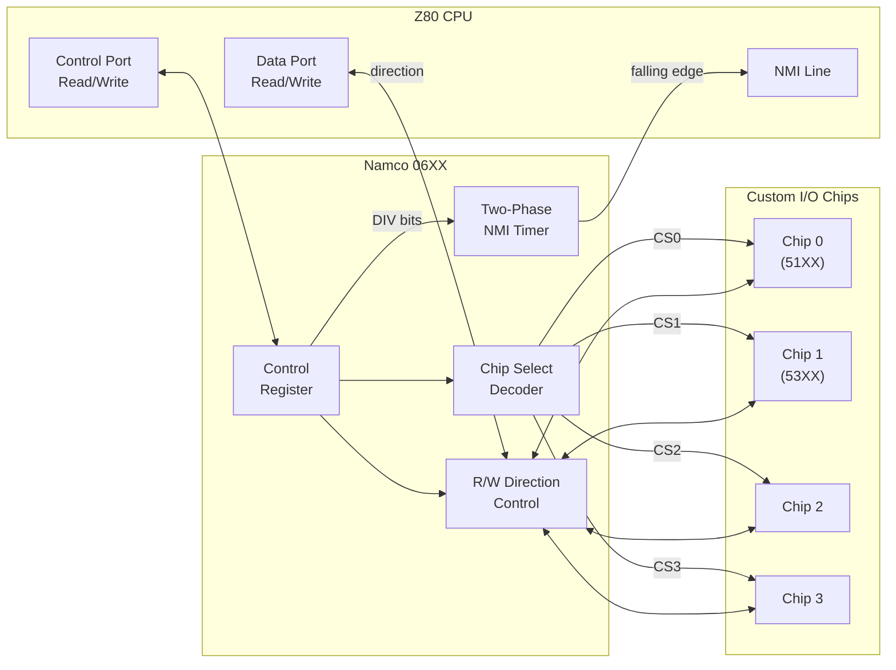
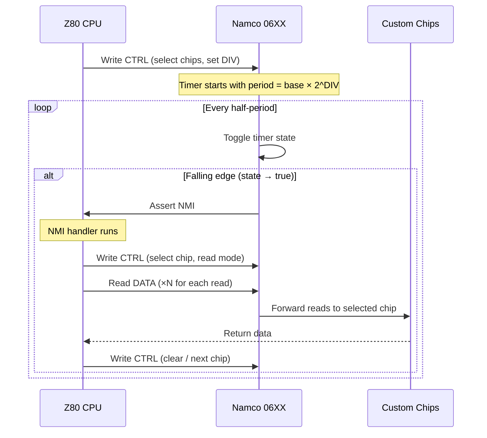

# Namco 06XX — Bus Arbiter and NMI Timer

Custom bus arbiter chip (1981, Namco Ltd.) that multiplexes CPU access to up to 4 custom I/O chips (51XX, 53XX, 50XX, 54XX, etc.) and generates periodic NMI interrupts to the controlling CPU via a programmable clock divider. The 06XX acts as the central I/O hub on Namco arcade boards, coordinating all communication between the CPU and the custom chip constellation.

Used in Galaga (1981), Dig Dug (1982), Xevious (1982), Pole Position (1982), and other Namco games of the era.

## CPU Interface

The 06XX is memory-mapped at two addresses in the CPU's address space — one for data transfer with the selected custom chips and one for the control register.

| Address | Name | Direction | Description |
| ------- | ---- | --------- | ----------- |
| $x000 | DATA | Read/Write | Data port — reads from or writes to the currently selected custom chip(s) |
| $x100 | CTRL | Read/Write | Control register — chip select, direction, and timer configuration |

The exact base address varies by board (e.g., $7000/$7100 on Galaga).

## Control Register

The control register is a single read/write byte that configures chip selection, data direction, and the NMI timer simultaneously.

| Bits | Name | Description |
| ---- | ---- | ----------- |
| 3:0 | CS | Chip select mask (active-high, one bit per custom chip) |
| 4 | R/W | Data direction: 1 = read from chips, 0 = write to chips |
| 7:5 | DIV | Clock divider: 0 = timer stopped, 1–7 = divide by 2^N |

### Chip Select (bits 3:0)

Each bit enables one of the four custom chip slots:

| Bit | Chip Slot | Typical Assignment (Galaga) |
| --- | --------- | --------------------------- |
| 0 | Chip 0 | Namco 51XX (input multiplexer) |
| 1 | Chip 1 | Namco 53XX (DIP switch reader) |
| 2 | Chip 2 | (unused or Namco 50XX) |
| 3 | Chip 3 | (unused or Namco 54XX) |

Multiple chips can be selected simultaneously for broadcast writes, though typical firmware selects one at a time.

### Clock Divider (bits 7:5)

The divider field controls the NMI timer period:

| DIV Value | Timer Period (CPU cycles) | NMI Rate (at 3.072 MHz) |
| --------- | ------------------------- | ----------------------- |
| 0 | — (stopped) | No NMI |
| 1 | 128 | ~24 kHz |
| 2 | 256 | ~12 kHz |
| 3 | 512 | ~6 kHz |
| 4 | 1024 | ~3 kHz |
| 5 | 2048 | ~1.5 kHz |
| 6 | 4096 | ~750 Hz |
| 7 | 8192 | ~375 Hz |

The full NMI period is `base_divisor × 2^DIV` CPU cycles, where `base_divisor` is the ratio between the CPU clock and the 06XX's base clock (typically 64). The timer uses a two-phase design — it toggles an internal state at the half-period, and NMI fires on each falling edge.

## Architecture

### Block Diagram

### NMI Timer Sequence

### Read Stretch Suppression

When the control register is written with read mode (bit 4 = 1), the 06XX suppresses the first NMI pulse after the timer restarts. This "read stretch" prevents the NMI from firing before the CPU has finished setting up the read operation, avoiding a race condition where the NMI handler would run before the chip is ready to be read.

## Emulation Approach

The timer is advanced once per CPU cycle via `tick()`, counting down to zero and toggling the two-phase state. The board checks `take_nmi()` after each tick to detect and clear the pending NMI.

Key design decisions:

- **Cycle-granular timer**: The timer counts in CPU cycles rather than at the 06XX's native clock rate, avoiding the need for a separate clock divider. The `base_divisor` parameter (typically 64) converts between the two rates at initialization.
- **Two-phase toggle**: The internal `timer_state` flag toggles at each half-period. NMI fires only on the transition to `true` (falling edge), matching the hardware's edge-triggered behavior.
- **Read stretch**: Setting read mode suppresses exactly one NMI pulse via the `read_stretch` flag, which is cleared after the next half-period boundary. This matches the hardware's behavior of delaying the first NMI when transitioning to read mode.
- **Chip routing in the board**: The 06XX itself does not contain the custom chips — it only tracks selection and timing. The board implementation queries `chip_select(n)` and `is_read_mode()` to route data reads/writes to the appropriate device (51XX, 53XX, etc.).

## Resources

- [Galaga Hardware — Computer Archeology](https://computerarcheology.com/Arcade/Galaga/) — PCB analysis including 06XX I/O bus protocol and memory map
- [MAME namco06.cpp](https://github.com/mamedev/mame/blob/master/src/mame/namco/namco06.cpp) — Reference 06XX emulation with timer and chip select logic (BSD-3-Clause)
- [Galaga — Wikipedia](https://en.wikipedia.org/wiki/Galaga) — Game history and hardware overview
