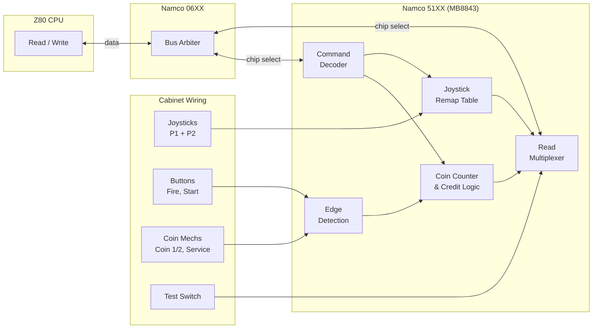
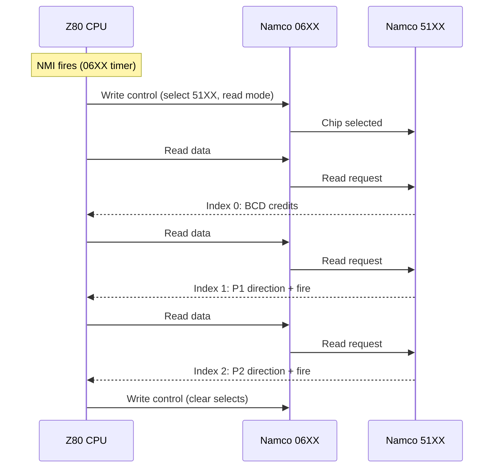

# Namco 51XX — Input Multiplexer

Custom I/O chip (1981, Namco Ltd.) that handles coin counting, credit management, joystick remapping, and input multiplexing for Namco arcade games. In hardware, this is a Fujitsu MB8843 4-bit microcontroller running Namco-proprietary firmware. The emulation reproduces the firmware's external behavior directly without simulating the MCU.

Used in Galaga (1981), Dig Dug (1982), Xevious (1982), Pole Position (1982), and other Namco games of the era.

## CPU Interface

The 51XX communicates with the host CPU exclusively through the Namco 06XX bus arbiter. The 06XX selects the 51XX via its chip-select bits and provides read/write direction control. There are no direct address lines — all communication is through a single data port.

| Operation | Direction | Description |
| --------- | --------- | ----------- |
| Write | CPU → 51XX | Command byte or argument nibble |
| Read | 51XX → CPU | Returns next byte in 3-read sequence |

## Input Ports

The 51XX reads two 8-bit input ports directly from the cabinet wiring (active-low):

| Port | Bits | Signal |
| ---- | ---- | ------ |
| IN0 | 3:0 | P1 joystick: Left, Down, Right, Up |
| IN0 | 7:4 | P2 joystick: Left, Down, Right, Up |
| IN1 | 0 | P1 Fire |
| IN1 | 1 | P2 Fire |
| IN1 | 2 | Start 1 |
| IN1 | 3 | Start 2 |
| IN1 | 4 | Coin 1 |
| IN1 | 5 | Coin 2 |
| IN1 | 6 | Service coin |
| IN1 | 7 | Test / Service mode |

All inputs are active-low: 0 = pressed/active, 1 = released/inactive.

## Command Interface

Commands are written as single bytes. Command 0x01 expects 4 argument nibbles in subsequent writes.

| Command | Arguments | Description |
| ------- | --------- | ----------- |
| 0x00 | — | No operation |
| 0x01 | 4 nibbles | Set coinage: coins_per_credit[0], creds_per_coin[0], coins_per_credit[1], creds_per_coin[1] |
| 0x02 | — | Enter credit mode (processed inputs with coin/credit logic) |
| 0x03 | — | Disable joystick remapping (return raw 4-bit values) |
| 0x04 | — | Enable joystick remapping (return direction codes) |
| 0x05 | — | Enter switch mode (raw input bytes) |
| 0x06–0x07 | — | No operation |

Only the low 3 bits of the command byte are decoded.

## Operating Modes

### Switch Mode (command 0x05)

Returns raw input port values in a 3-read cycle:

| Read Index | Returns |
| ---------- | ------- |
| 0 | IN0 (raw joystick byte) |
| 1 | IN1 (raw buttons/coins byte) |
| 2 | 0x00 |

### Credit Mode (command 0x02)

Processes coin insertions, manages credits, and returns formatted player input in a 3-read cycle:

| Read Index | Returns |
| ---------- | ------- |
| 0 | BCD credit count (high nibble = tens, low nibble = ones) |
| 1 | P1 input: direction + fire state |
| 2 | P2 input: direction + fire state |

Special case: if test mode is active (IN1 bit 7 = 0), read index 0 returns 0xBB.

#### Credit Logic

Coin handling uses rising-edge detection on the active-high conversion of IN1:

- **Coin 1** (IN1 bit 4): Increments slot 0 counter; when it reaches `coins_per_credit[0]`, awards `creds_per_coin[0]` credits
- **Coin 2** (IN1 bit 5): Same logic using slot 1 coinage settings
- **Service coin** (IN1 bit 6): Awards 1 credit immediately
- **Free play**: When `coins_per_credit[0]` is 0, credits are pinned to 100

Credits are capped at 99 and returned as BCD (e.g., 25 credits → 0x25).

#### Start Button Logic

Start buttons are only processed in the "waiting for start" sub-state:

- **Start 1** (IN1 bit 2): Deducts 1 credit, transitions to "game active"
- **Start 2** (IN1 bit 3): Deducts 2 credits, transitions to "game active"

#### Player Input Format

Reads 1 and 2 return a combined byte for P1 and P2 respectively:

```text
Bit 5:    Fire button held (1 = pressed)
Bit 4:    Fire button edge (1 = newly pressed this read)
Bits 3:0: Direction code (remapped or raw)
```

### Joystick Remapping

When enabled (default), the raw 4-bit active-low joystick value is converted to a direction code via a lookup table:

| Raw (LDRU) | Direction | Code |
| ---------- | --------- | ---- |
| 1111 | Center | 8 |
| 1110 | Up | 0 |
| 0110 | Up-Right | 1 |
| 0100 | Right | 2 |
| 0101 | Down-Right | 3 |
| 0111 | Down | 4 |
| 1101 | Down-Left | 5 |
| 1100 | Left | 6 |
| 1110 | Up-Left | 7 |

When remapping is disabled (command 0x03), the raw 4-bit value is returned directly.

## Architecture

### Block Diagram



### Read Sequence



## Emulation Approach

The emulation implements the MB8843 firmware's external behavior as a state machine, avoiding the complexity and cost of emulating the 4-bit MCU itself.

Key design decisions:

- **State machine commands**: The write interface is modeled as a two-state machine — either accepting a command byte or collecting coinage arguments for command 0x01.
- **Edge detection**: Coin and button presses use XOR-based toggle detection against the previous frame's input state, matching the firmware's debounce-free sampling behavior.
- **3-read cycle**: Each 06XX read sequence returns credits, P1, then P2 via a mod-3 counter, matching the firmware's output pattern exactly.
- **Active-low convention**: Inputs are stored in their native active-low form and inverted only during edge detection, minimizing bit manipulation and matching the hardware signal polarity.
- **Credit clamping**: Credits saturate at 99 using `saturating_add` and `min(99)`, matching the firmware's BCD display limit.

## Resources

- [Galaga Hardware — Computer Archeology](https://computerarcheology.com/Arcade/Galaga/) — PCB analysis including I/O chip interaction and memory map
- [MAME namco51.cpp](https://github.com/mamedev/mame/blob/master/src/mame/namco/namco51.cpp) — Reference 51XX emulation with credit logic and joystick remapping (BSD-3-Clause)
- [MB8843 Datasheet — Fujitsu](https://www.jasondsmith.dev/resources/mb8843.pdf) — 4-bit MCU used as the 51XX's silicon (pinout and instruction set)
- [Galaga — Wikipedia](https://en.wikipedia.org/wiki/Galaga) — Game history and hardware overview
