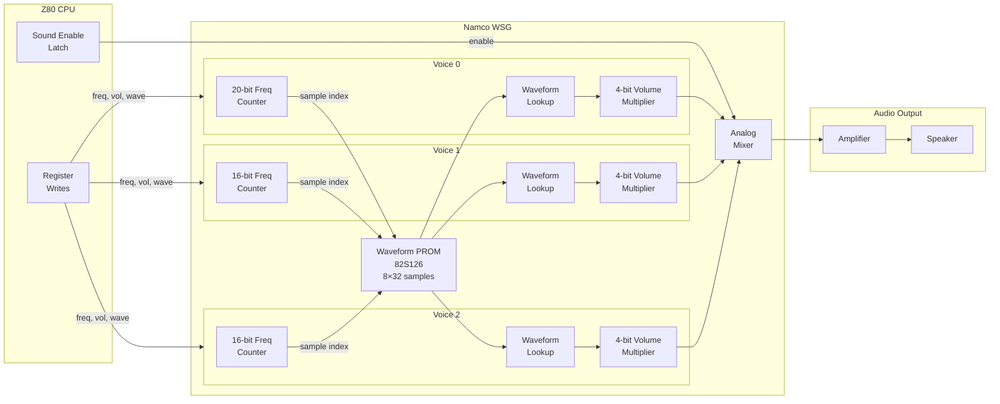

# Namco WSG (Waveform Sound Generator)

3-voice wavetable synthesizer (1980, Namco Ltd.) used across Namco's early arcade hardware. Each voice reads through a 32-sample, 4-bit waveform stored in PROM at a programmable frequency and volume. The chip is not a discrete IC but a custom circuit integrated into the Namco arcade PCBs.

Used in Pac-Man (1980), Galaga (1981), Dig Dug (1982), and other Namco arcade games of the era.

## CPU Interface

The WSG is mapped into the CPU's address space as 32 nibble-wide write-only registers. On the Pac-Man PCB these appear at $5040–$505F; on Galaga they are accessed through the shared memory map. A separate sound-enable latch gates all audio output.

| Address | Name | Direction | Description |
| ------- | ---- | --------- | ----------- |
| $5040–$505F | Sound Regs | Write | 32 nibble-wide voice registers (only low 4 bits used) |
| $5001 | Sound Enable | Write | Bit 0: 1 = sound on, 0 = silence |

## Register Map

All registers are 4 bits wide (only the low nibble of each write is used).

| Offset | Channel | Function |
| ------ | ------- | -------- |
| $05 | 0 | Waveform select (0–7) |
| $0A | 1 | Waveform select (0–7) |
| $0F | 2 | Waveform select (0–7) |
| $10 | 0 | Frequency bits 3:0 (extra low nibble, 20-bit total) |
| $11 | 0 | Frequency bits 7:4 |
| $12 | 0 | Frequency bits 11:8 |
| $13 | 0 | Frequency bits 15:12 |
| $14 | 0 | Frequency bits 19:16 |
| $15 | 0 | Volume (0–15) |
| $16 | 1 | Frequency bits 7:4 |
| $17 | 1 | Frequency bits 11:8 |
| $18 | 1 | Frequency bits 15:12 |
| $19 | 1 | Frequency bits 19:16 |
| $1A | 1 | Volume (0–15) |
| $1B | 2 | Frequency bits 7:4 |
| $1C | 2 | Frequency bits 11:8 |
| $1D | 2 | Frequency bits 15:12 |
| $1E | 2 | Frequency bits 19:16 |
| $1F | 2 | Volume (0–15) |

Channel 0 has 20-bit frequency resolution (registers $10–$14). Channels 1 and 2 have 16-bit frequency (registers $16–$19, $1B–$1E) — the lowest 4 bits are implicitly zero.

## Waveform PROM

The waveform data is stored in a 256-byte bipolar PROM (82S126 on Pac-Man). It contains 8 waveforms of 32 samples each, with only the low 4 bits of each byte used.

```text
Waveform 0:  bytes $00–$1F  (32 samples)
Waveform 1:  bytes $20–$3F
Waveform 2:  bytes $40–$5F
  ...
Waveform 7:  bytes $E0–$FF
```

Each 4-bit sample is interpreted as signed by subtracting 8, producing a range of -8 to +7. Waveform 0 on Pac-Man is a sine wave; others include sawtooth, triangle, and game-specific timbres.

## Architecture

### Block Diagram



### Voice Generation

Each voice operates independently with the same algorithm:

1. **Accumulate**: The frequency counter is incremented by the frequency register value every tick
2. **Index**: Bits 24:20 (for 20-bit freq) of the counter select one of 32 samples from the chosen waveform
3. **Scale**: The 4-bit sample (-8 to +7) is multiplied by the 4-bit volume (0–15)
4. **Mix**: All three voice outputs are summed to produce the final sample

The frequency counter wraps naturally, producing a continuous waveform at a frequency determined by:

```text
output_freq = frequency_reg × master_clock / 6 / 32 / 2^20
```

For a standard 18.432 MHz master clock (3.072 MHz CPU clock):

```text
output_freq = frequency_reg × 96000 / 1048576
            ≈ frequency_reg × 0.0916 Hz
```

### Clock Hierarchy

| Clock | Frequency | Derivation | Purpose |
| ----- | --------- | ---------- | ------- |
| Master | 18.432 MHz | Crystal oscillator | System clock |
| CPU | 3.072 MHz | Master / 6 | Z80 CPU clock |
| WSG sample | 96 kHz | CPU / 32 | Waveform sample rate |

## Emulation Approach

The emulator advances the WSG once per CPU clock cycle rather than at the hardware's native 96 kHz sample rate. This simplifies integration — the board just calls `tick()` alongside the CPU — while producing identical waveform output through careful fractional-bit arithmetic.

Key design decisions:

- **CPU-rate accumulation**: The frequency counter runs at 3.072 MHz instead of 96 kHz (16x faster). To compensate, 4 extra fractional bits are added to the counter (20 total), making the effective sample position advance at the same rate as hardware.
- **Resampling**: An `AudioResampler` converts from the CPU clock rate down to 44.1 kHz for the host audio system, handling the anti-aliasing and sample rate conversion.
- **Signed samples**: Raw 4-bit PROM values (0–15) are converted to signed (-8 to +7) by subtracting 8, matching the hardware's center-biased DAC output.
- **Mixing headroom**: Three voices at maximum amplitude produce ±315 (3 × 7 × 15). This is scaled to ~75% of the i16 range to avoid clipping while preserving dynamic range.
- **Register deduplication**: Writes are ignored if the value hasn't changed, avoiding unnecessary recalculation of derived voice parameters.

## Resources

- [Pac-Man Sound Hardware — Computer Archeology](https://www.computerarcheology.com/Arcade/PacMan/Hardware.html) — PCB analysis including WSG register map and waveform PROM contents
- [MAME namco.cpp](https://github.com/mamedev/mame/blob/master/src/devices/sound/namco.cpp) — Reference WSG emulation with frequency counter and mixing logic (BSD-3-Clause)
- [Pac-Man — Wikipedia](https://en.wikipedia.org/wiki/Pac-Man) — Game history and hardware overview
- [82S126 PROM Datasheet — Signetics](https://archive.org/details/bitsavers_signetics8esPROMs_1742044) — Bipolar PROM IC used for waveform storage
