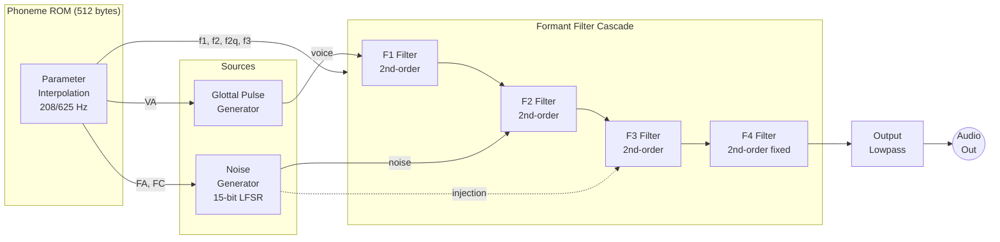
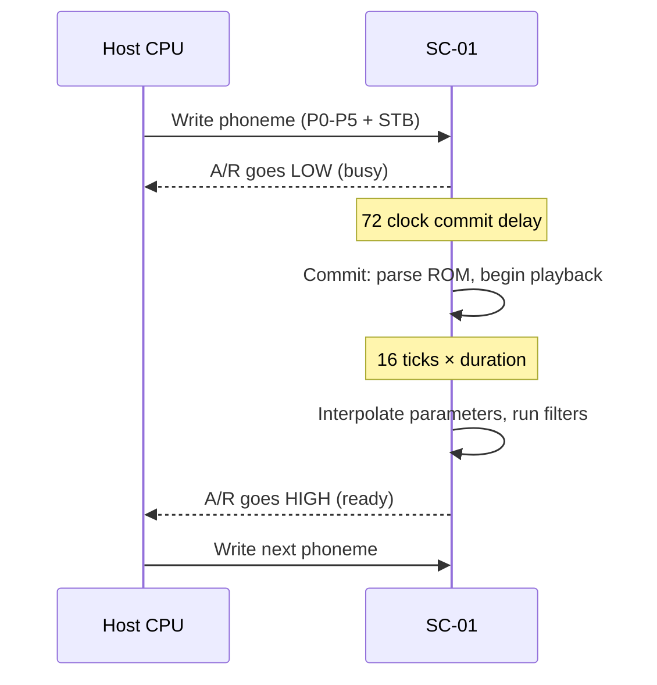

# Votrax SC-01 Speech Synthesizer

Single-chip CMOS formant speech synthesizer (1980, Federal Screw Works). Accepts 6-bit phoneme codes and produces continuous speech by interpolating between stored formant filter parameters. Used in arcade games including Q\*Bert, Gorf, and Wizard of Wor.

The SC-01A (1981) is a ROM revision with improved parameter tuning and reduced DC offset. Both variants are pin-compatible and use the same synthesis architecture.

## Pin Interface

| Pin | Name | Direction | Description |
| --- | ---- | --------- | ----------- |
| P0-P5 | Phoneme | Input | 6-bit phoneme code (active-high, active on STB falling edge) |
| I0-I1 | Inflection | Input | 2-bit pitch inflection level |
| STB | Strobe | Input | Latches phoneme data on falling edge |
| A/R | Request | Output | High = ready for next phoneme, Low = busy |
| MCX | Clock In | Input | External master clock (typ. 720 kHz) |
| MCRC | Clock RC | I/O | RC timing for on-chip oscillator |
| AO | Audio Out | Output | Analog speech waveform |
| Vp | Power | - | +5V supply |
| Vss | Ground | - | Ground reference |

## Phoneme Table

64 phonemes encoded as 6-bit codes. Duration varies by phoneme (47-250 ms at nominal clock).

| Code | Symbol | Example | ms | | Code | Symbol | Example | ms |
| ---- | ------ | ------- | -- | - | ---- | ------ | ------- | -- |
| 0x00 | EH3 | jack**e**t | 59 | | 0x20 | A | d**ay** | 185 |
| 0x01 | EH2 | **e**nlist | 71 | | 0x21 | AY | d**ay** | 65 |
| 0x02 | EH1 | h**ea**vy | 121 | | 0x22 | Y1 | **y**ard | 80 |
| 0x03 | PA0 | *(pause)* | 47 | | 0x23 | UH3 | miss**io**n | 47 |
| 0x04 | DT | bu**tt**er | 47 | | 0x24 | AH | m**o**p | 250 |
| 0x05 | A2 | m**a**de | 71 | | 0x25 | P | **p**ast | 103 |
| 0x06 | A1 | m**a**de | 103 | | 0x26 | O | c**o**ld | 185 |
| 0x07 | ZH | a**z**ure | 90 | | 0x27 | I | p**i**n | 185 |
| 0x08 | AH2 | h**o**nest | 71 | | 0x28 | U | m**oo**ve | 185 |
| 0x09 | I3 | inh**i**bit | 55 | | 0x29 | Y | an**y** | 103 |
| 0x0A | I2 | inh**i**bit | 80 | | 0x2A | T | **t**ap | 71 |
| 0x0B | I1 | inh**i**bit | 121 | | 0x2B | R | **r**ed | 90 |
| 0x0C | M | **m**at | 103 | | 0x2C | E | m**ee**t | 185 |
| 0x0D | N | su**n** | 80 | | 0x2D | W | **w**in | 80 |
| 0x0E | B | **b**ag | 71 | | 0x2E | AE | d**a**d | 185 |
| 0x0F | V | **v**an | 71 | | 0x2F | AE1 | **a**fter | 103 |
| 0x10 | CH | **ch**ip | 71 | | 0x30 | AW2 | s**a**lty | 90 |
| 0x11 | SH | **sh**op | 121 | | 0x31 | UH2 | ab**ou**t | 71 |
| 0x12 | Z | **z**oo | 71 | | 0x32 | UH1 | **u**ncle | 103 |
| 0x13 | AW1 | l**aw**ful | 146 | | 0x33 | UH | c**u**p | 185 |
| 0x14 | NG | thi**ng** | 121 | | 0x34 | O2 | f**o**r | 80 |
| 0x15 | AH1 | f**a**ther | 146 | | 0x35 | O1 | ab**oar**d | 121 |
| 0x16 | OO1 | l**oo**king | 103 | | 0x36 | IU | **you** | 59 |
| 0x17 | OO | b**oo**k | 185 | | 0x37 | U1 | y**ou** | 90 |
| 0x18 | L | **l**and | 103 | | 0x38 | THV | **th**e | 80 |
| 0x19 | K | tric**k** | 80 | | 0x39 | TH | **th**in | 71 |
| 0x1A | J | **j**udge | 47 | | 0x3A | ER | b**ir**d | 146 |
| 0x1B | H | **h**ello | 71 | | 0x3B | EH | g**e**t | 185 |
| 0x1C | G | **g**et | 71 | | 0x3C | E1 | b**e** | 121 |
| 0x1D | F | **f**ast | 103 | | 0x3D | AW | c**a**ll | 250 |
| 0x1E | D | pai**d** | 55 | | 0x3E | PA1 | *(pause)* | 185 |
| 0x1F | S | pa**ss** | 90 | | 0x3F | STOP | *(stop)* | 47 |

## Architecture

### Block Diagram



### Clock Hierarchy

The master clock (typically 720 kHz on Gottlieb boards) is internally divided:

| Clock | Rate | Derivation | Purpose |
| ----- | ---- | ---------- | ------- |
| Main | 720 kHz | External | Master oscillator |
| sclock | 40 kHz | Main / 18 | Audio sample rate |
| cclock | 20 kHz | Main / 36 | Switched-capacitor filter clock |
| 5 kHz | 5 kHz | Main / 144 | Duration tick base |
| 625 Hz | 625 Hz | Main / 1,152 | Amplitude interpolation |
| 208 Hz | 208 Hz | Main / 3,456 | Formant interpolation |

### ROM Format

The 512-byte internal ROM stores 64 phoneme entries (8 bytes each, little-endian u64). Parameters are interleaved across bit positions, a layout artifact of the original die routing:

| Bits | Field | Width | Description |
| ---- | ----- | ----- | ----------- |
| 0,7,14,21 | F1 | 4 | First formant frequency |
| 1,8,15,22 | VA | 4 | Voice amplitude |
| 2,9,16,23 | F2 | 4 | Second formant frequency |
| 3,10,17,24 | FC | 4 | Noise frequency cutoff |
| 4,11,18,25 | F2Q | 4 | Second formant Q |
| 5,12,19,26 | F3 | 4 | Third formant frequency |
| 6,13,20,27 | FA | 4 | Noise (fricative) amplitude |
| 34,32,30,28 | CLD | 4 | Closure delay (ticks) |
| 35,33,31,29 | VD | 4 | Voice delay (ticks) |
| 36 | Closure | 1 | Glottal closure flag |
| 37-43 | Duration | 7 | Phoneme duration (inverted) |
| 56-61 | Phone | 6 | Phoneme code (lookup key) |

CLD and VD use reversed bit ordering (34,32,30,28 instead of 28,30,32,34) — a deliberate compensation for a prototype miswiring that was baked into the ROM rather than fixed in silicon.

### Formant Filter Pipeline

The analog signal path runs at sclock (~40 kHz) and consists of 13 stages:

1. **Glottal pulse** lookup from a 9-value transistor resistor ladder waveform, indexed by pitch counter
2. **Voice amplitude** scaling by VA (4-bit exponential)
3. **F1** bandpass filter (variable frequency, controlled by `filt_f1`)
4. **F2 voice** bandpass filter (variable frequency and Q)
5. **Noise gate**: LFSR output gated by pitch bit 6, scaled by FA
6. **Noise shaper** bandpass filter (fixed coefficients)
7. **Noise cutoff** scaling by FC
8. **F2 noise** bandpass filter (same frequency as F2 voice, lower order)
9. **Voice + noise mix** into F3
10. **F3** bandpass filter (variable frequency)
11. **Secondary noise injection** scaled by inverse FC
12. **F4** bandpass filter (fixed frequency ~3.4 kHz)
13. **Output lowpass** (fixed ~3.5 kHz anti-aliasing)

Each filter stage uses switched-capacitor design: binary-weighted capacitor arrays controlled by CMOS switches at 20 kHz simulate variable resistances. Only capacitor *ratios* matter for frequency response, making the design tolerant of process variation.

### Timing

Each phoneme plays for 16 "ticks." Each tick lasts `(duration * 4 + 1)` phonetick periods, where each phonetick is one cclock cycle (one 20 kHz period). During playback:

- At tick = CLD: glottal closure activates (silence for plosives)
- At tick = VD: noise amplitude (FA) interpolation begins
- At tick = CLD: voice amplitude (VA) interpolation begins
- Every 625 Hz: amplitude parameters (FA, VA) take one interpolation step
- Every 208 Hz: formant parameters (F1, F2, F2Q, F3, FC) take one interpolation step
- Interpolation: `reg = reg - (reg >> 3) + (target << 1)` (exponential approach, ~8 steps to converge)

The 625 Hz and 208 Hz rates are derived from a 6-bit update counter (mod 48) running at cclock. The 625 Hz tick fires when `counter & 0x0F == 0` (3 times per cycle), and the 208 Hz tick fires at `counter == 0x28` (once per cycle), phased to fall exactly between two 625 Hz ticks.

**Die bugs**: The original silicon has two swapped interpolation assignments. FC (noise cutoff) is interpolated at 208 Hz with the formants instead of at 625 Hz with the amplitudes, and VA (voice amplitude) is interpolated at 625 Hz instead of at 208 Hz. These bugs are compensated in the ROM data and must be faithfully reproduced for correct output.

### Pitch Counter

The 8-bit pitch counter increments every cclock tick and wraps to zero when it reaches:

```text
pitch_limit = (0xE0 ^ (inflection << 5) ^ (filt_f1 << 1)) + 2
```

This creates a variable pitch period controlled by the 2-bit inflection input and the current F1 formant value. Higher inflection or F1 values shorten the period, raising pitch. The `+2` accounts for propagation delay in the comparator logic.

Filter coefficients are committed to the analog path when `(pitch & 0xF9) == 0x08`, which matches 4 consecutive pitch values per period (bits [2:1] free). This synchronizes parameter changes to the glottal cycle.

### Noise Generator

A 15-bit linear feedback shift register (LFSR) advances every cclock tick:

- **Feedback**: NXOR of bits 14 and 13 (equivalence gate)
- **Input**: `cur_noise AND (noise != 0x7FFF)` — the all-ones check prevents LFSR lockup
- **Output**: `cur_noise` is the inverted XOR of the two MSBs

The noise output is gated by pitch bit 6 in the analog path, creating a pseudo-random signal shaped by the glottal cycle.

### Closure Counter

A 5-bit counter (0-28) controls the glottal closure amplitude envelope:

- **Reset to 0** when `cur_closure` is false and voice/noise volume is nonzero (open glottis producing sound)
- **Ramps toward 28** otherwise (closed glottis, fading in)
- Maximum value is `7 << 2 = 28`; the two LSBs provide sub-step resolution used in the analog path

During pause phonemes, formant interpolation freezes unless both FA and VA reach zero, preventing abrupt parameter jumps when resuming speech.

### Filter Coefficient Calculation

The SC-01 uses switched-capacitor filters — capacitor arrays switched at cclock (20 kHz) simulate variable resistances. Since only capacitor *ratios* matter, absolute capacitance values cancel out, making the design robust across process variation. All capacitor "values" in the implementation are actually die areas in square micrometers.

Each variable formant filter has a set of fixed capacitors plus a bank of binary-weighted capacitors selected by the 4-bit (or 5-bit for F2) filter parameter. The `bits_to_caps()` function sums the selected capacitors:

| Filter | Fixed (µm²) | Switchable caps (µm²) | Parameter bits |
| ------ | ----------- | --------------------- | -------------- |
| F1 | 2,280 | 2546, 4973, 9861, 19724 | `filt_f1` (4) |
| F2 | 2,352 | 833, 1663, 3164, 6327, 12654 | `filt_f2` (5) |
| F2 Q | 829 | 1390, 2965, 5875, 11297 | `filt_f2q` (4) |
| F3 | 8,480 | 2226, 4485, 9056, 18111 | `filt_f3` (4) |

Four filter types are implemented:

- **Standard** (F1, F2 voice, F3, F4): 2nd-order bandpass, H(s) = (1 + k₀s) / (1 + k₁s + k₂s²), produces 4 a/b coefficients each
- **Lowpass** (output FX): 1st-order, H(s) = 1 / (1 + ks), with a 150/4000 Hz fudge factor to match recordings
- **Noise shaper** (FN): 2nd-order bandpass, H(s) = k₀s / (1 + k₁s + k₂s²), produces 3 a/b coefficients
- **Injection** (F2 noise): Neutralized (zeroed) due to numerical instability — retained for documentation

The analog transfer functions are converted to digital IIR filters using the bilinear z-transform with frequency pre-warping at the estimated peak frequency: `fr = sqrt(|k₀k₁ - k₂|) / (2πk₂)`. This ensures the filter response is most accurate near its resonance.

### A/R Handshake



The host polls A/R to pace phoneme output. Writing a new phoneme while the previous one is still playing interrupts it immediately.

## Emulation Approach

The real chip uses switched-capacitor filters operating at 20 kHz. This implementation models them as IIR biquad filters with coefficients derived via the bilinear z-transform with frequency pre-warping (matching the MAME approach). The `analog_calc()` function runs at sclock (~40 kHz), computing the full 13-stage signal path each sample:

1. Glottal pulse lookup from a 9-entry waveform table, scaled by VA
2. Voice signal through F1 and F2 bandpass filters (IIR with `apply_filter`/`shift_hist`)
3. Noise from LFSR, gated by pitch bit 6, scaled by FA, shaped by the noise bandpass, then scaled by FC through the F2 noise filter
4. Voice and noise mixed into F3, with secondary noise injection weighted by inverse FC
5. F4 bandpass, closure amplitude envelope, and final output lowpass
6. Output scaled by 0.35 and resampled from ~40 kHz to 44.1 kHz via `AudioResampler<f32>`

The phoneme ROM is loaded externally (not embedded) since it contains proprietary data. The glottal waveform and phoneme name table are embedded as constants, as they describe the chip's circuit design rather than ROM contents.

## Board Integration (Gottlieb System 80)

The Votrax SC-01A is wired to the Gottlieb Rev 1 sound board as follows:

| Signal | Connection |
| ------ | ---------- |
| **Address** | 0x2000-0x2FFF in sound CPU (M6502) address space |
| **Data write** | Bits 0-5 → phoneme code, bits 6-7 → inflection |
| **A/R output** | RIOT 6532 Port B bit 7 (active-high = ready); rising edge → sound CPU NMI |
| **Clock** | 720 kHz VCO (nominal), independent of M6502 clock |
| **Audio** | Mixed additively with MC1408 DAC output |

The phoneme data is active-low on the bus (the board inverts it). The M6502 firmware writes a phoneme byte to 0x2000; the A/R rising edge fires an NMI, and the NMI handler writes the next phoneme. A speech clock DAC at 0x3000 adjusts the VCO frequency (currently stubbed at the nominal 720 kHz).

The Votrax phoneme ROM (`sc01a.bin`, 512 bytes) is loaded as an optional ROM. Games run without it but produce no speech output.

## Resources

- [Votrax SC-01 Data Sheet (1980)](https://archive.org/details/Votrax_SC-01_Data_Sheet/mode/1up) -- Original Federal Screw Works datasheet (Internet Archive scan)
- [Votrax SC-01 Application Note](https://archive.org/details/Votrax_SC-01_Application_Note) -- Circuit examples and usage notes
- [US Patent 4,433,210](https://patents.google.com/patent/US4433210A) -- "Integrated circuit phoneme-based speech synthesizer" (Ostrowski & White, 1984); describes the switched-capacitor filter architecture
- [Votrax SC-01 -- Vocal Synthesis Wiki](https://vocal-synthesis.fandom.com/wiki/Votrax_SC-01) -- Phoneme table, history, specifications
- [SC-01A Technical Info -- Red Cedar](https://www.redcedar.com/sc01.htm) -- Pinout, application notes, errata
- [MAME votrax.cpp](https://github.com/mamedev/mame/blob/master/src/devices/sound/votrax.cpp) -- Reference emulation by Olivier Galibert (BSD-3-Clause)
- [Votrax -- Wikipedia](https://en.wikipedia.org/wiki/Votrax) -- Company and product history
