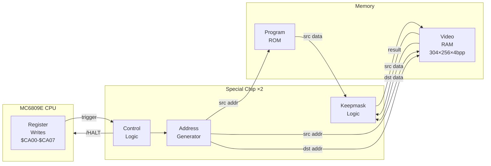
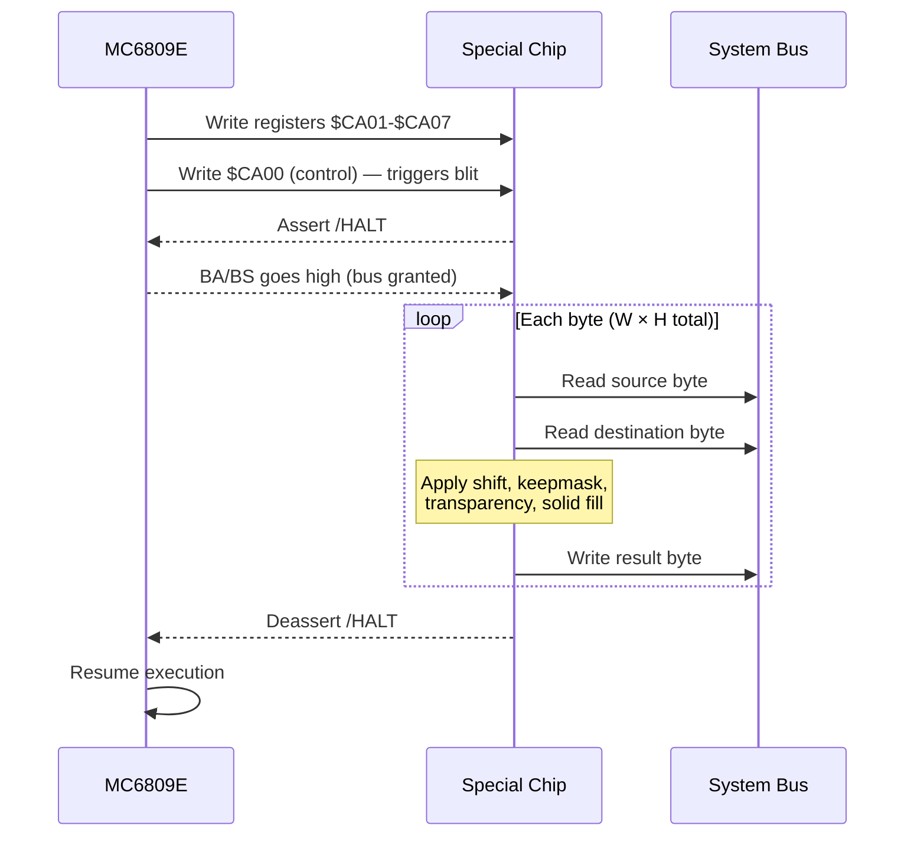

# Williams Special Chip (Blitter / DMA Engine)

Custom 40-pin DMA graphics processor (1982, VLSI Technology Inc.) used in Williams 2nd-generation arcade boards. Performs block memory transfers — copy, fill, shift, and transparency — without CPU involvement, halting the 6809 for the duration of each blit. Two chips operate in parallel on each ROM board: one handles the upper nibble (D7-D4) and one handles the lower nibble (D3-D0), together processing one full byte per cycle.

Used in Robotron: 2084, Joust, Bubbles, Sinistar, Splat!, Mystic Marathon, Turkey Shoot, Joust 2, and Blaster.

Two silicon revisions exist:

- **SC1** (VL2001): Original. Has the "XOR 4" bug on width/height registers.
- **SC2** (VL2001A): Bug-fixed revision. Games target one or the other.

## Pin Interface

40-pin DIP package. Two chips per board share the address and data buses. Pin 14 selects upper (high) or lower (low) chip. Pins 15 and 24 are not bonded to the die.

| Pin | Name | Direction | Description |
| --- | ---- | --------- | ----------- |
| 14 | SEL | Input | Chip select: high = upper nibble, low = lower nibble |
| 3 | ROW | Output | Pulses once per horizontal row blitted |
| — | A0-A15 | Bidir | Shared 16-bit address bus |
| — | D0-D3 | Bidir | 4-bit data bus (one nibble per chip) |
| — | /HALT | Output | Active-low CPU halt request |
| — | BA/BS | Input | CPU bus-available / bus-status (active = bus granted) |

## Register Map

Eight write-only registers at $CA00-$CA07. Writing offset 0 (control byte) triggers the blit; all other registers should be configured first.

| Offset | Address | Name | Description |
| ------ | ------- | ---- | ----------- |
| 0 | $CA00 | Control | Control byte — **writing triggers blit** |
| 1 | $CA01 | Solid color | Source byte for solid fill mode |
| 2 | $CA02 | Source high | Source address high byte |
| 3 | $CA03 | Source low | Source address low byte |
| 4 | $CA04 | Dest high | Destination address high byte |
| 5 | $CA05 | Dest low | Destination address low byte |
| 6 | $CA06 | Width | Blit width in bytes (XOR'd with 4 on SC1) |
| 7 | $CA07 | Height | Blit height in rows (XOR'd with 4 on SC1) |

Registers are write-only on real hardware. Reading $CA00 does **not** initiate a blit. All registers retain their values across blits — omitting a write reuses the previous value.

## Control Byte

| Bit | Flag | Description |
| --- | ---- | ----------- |
| 0 | SRC_STRIDE_256 | Source uses stride-256 (column-major video layout) |
| 1 | DST_STRIDE_256 | Destination uses stride-256 (column-major video layout) |
| 2 | SLOW | 0 = fast (1 µs/byte, ROM→RAM), 1 = slow (2 µs/byte, RAM→RAM) |
| 3 | FOREGROUND_ONLY | Per-nibble transparency: skip color-0 pixels |
| 4 | SOLID | Use solid_color register instead of reading source data |
| 5 | SHIFT | Right-shift source pixels by one position (4 bits) |
| 6 | NO_ODD | Suppress lower nibble (D3-D0) writes |
| 7 | NO_EVEN | Suppress upper nibble (D7-D4) writes |

## Architecture

### Block Diagram



### Video Memory Layout

The Williams video system uses a 304×256 framebuffer at 4 bits per pixel (16 colors from a 256-color palette: 3R/3G/2B). Video RAM is laid out in column-major order: consecutive bytes in memory represent vertically adjacent pixels, and the next column is 256 bytes away. This is why the blitter has stride-256 support — it matches the native screen layout.

### DMA Sequence



### Timing

| Mode | Cycles/byte | Throughput | Use case |
| ---- | ----------- | ---------- | -------- |
| Fast (SLOW=0) | 1 (1 µs) | 1 MB/s | ROM → RAM transfers |
| Slow (SLOW=1) | 2 (2 µs) | 500 KB/s | RAM → RAM transfers |

The slow mode is required for RAM-to-RAM transfers because the blitter must share bus cycles with DRAM refresh. ROM-to-RAM transfers can run at full speed because ROM does not require refresh arbitration.

Total blit time = W × H × cycles_per_byte. The CPU is fully halted for the entire duration.

### Stride Modes

The blitter supports two addressing modes, controlled independently for source and destination:

**Stride-1 (linear):**

- Column advance: address + 1
- Row advance: address + width
- Used for linear data in ROM (sprite sheets, tile data)

**Stride-256 (column-major):**

- Column advance: address + 256 (next screen column)
- Row advance: (address & 0xFF00) | ((address + 1) & 0x00FF)
- Row advance wraps within the 256-byte page
- Matches the native video RAM layout

### Pixel Write Logic (Keepmask)

Each byte contains two 4-bit pixels (even = upper nibble D7-D4, odd = lower nibble D3-D0). The blitter uses a "keepmask" to control which destination bits are preserved during writes:

```text
result = (dest & keepmask) | (source & ~keepmask)
```

For each nibble independently, the keepmask is determined by the interaction of three flags:

| FOREGROUND_ONLY | Source nibble | NO_EVEN/NO_ODD | Action |
| --------------- | ------------ | --------------- | ------ |
| 0 | any | 0 | **Write** (normal copy) |
| 0 | any | 1 | **Keep** (suppressed) |
| 1 | ≠ 0 | 0 | **Write** (opaque pixel) |
| 1 | ≠ 0 | 1 | **Keep** (suppressed) |
| 1 | = 0 | 0 | **Keep** (transparent) |
| 1 | = 0 | 1 | **Write** (inverted — clears nibble) |

The last row is notable: when FOREGROUND_ONLY and NO_EVEN/NO_ODD are both set, the transparency behavior *inverts* — color-0 pixels are written while non-zero pixels are suppressed.

### Shift Mode

When SHIFT is set, source pixels are right-shifted by one pixel position (4 bits) using a shift register that carries between bytes:

```text
output = ((previous_byte << 8) | current_byte) >> 4
```

The shift register is cleared at the start of each blit. This enables sub-byte-aligned sprite positioning.

### SC1 XOR 4 Bug

The SC1 (VL2001) applies XOR 4 to the width and height register values before using them. Game ROMs compensate by pre-XORing their dimensions. After XOR, values of 0 are clamped to 1.

The SC2 (VL2001A) fixes this bug (effective XOR value = 0).

### Solid Fill

When SOLID is set, the blitter writes the solid_color register value instead of reading source data. The source address still advances normally (the read is suppressed, not the address generator). This mode is commonly combined with FOREGROUND_ONLY for masked fills.

## Emulation Approach

The implementation models each DMA cycle individually via `do_dma_cycle()`, called once per system clock while the blitter is active. Each cycle:

1. Reads one source byte through the system bus (respecting ROM banking)
2. Optionally applies 4-bit right-shift via shift register
3. Reads the destination byte via direct VRAM access (bypassing ROM banking)
4. Computes the keepmask from FOREGROUND_ONLY, NO_EVEN, and NO_ODD flags
5. Applies solid color substitution if SOLID is set
6. Writes `(dest & keepmask) | (source & ~keepmask)` to destination
7. Advances source and destination addresses per stride mode
8. Returns 1 or 2 (cycles consumed) based on the SLOW flag

The board integration halts the CPU whenever `is_active()` is true, matching the real /HALT signal behavior.

Destination reads use `BusMaster::DmaVram` to bypass ROM banking overlays, matching the hardware where the blitter has direct VRAM access for read-modify-write operations.

The PROM color remap (a board-level feature on some games) is handled at the board level, not in the blitter itself.

## Resources

- [Williams Blitter — Sean Riddle](https://seanriddle.com/blitter.html) — Comprehensive reverse-engineering: register map, control bits, XOR bug, timing, die shots of the VL2001
- [Williams Hardware — Sean Riddle](https://seanriddle.com/willhard.html) — System-level hardware description: memory map, video layout, CPU/blitter interaction
- [Blitter Test Files — Sean Riddle](https://seanriddle.com/blittest.html) — Test ROMs and expected results for validating blitter behavior
- [Williams Games — Sean Riddle](https://seanriddle.com/willy.html) — Game-specific hardware notes, ROM board variations
- [Special Chip Info and Die Shots — Arcade Museum Forums](https://forums.arcade-museum.com/threads/special-chip-info-and-die-shots.268347/) — Die photography and physical chip analysis
- [Special Chips — Robotron 2084 Guidebook](http://www.robotron2084guidebook.com/technical/specialchips/) — Overview of SC1/SC2 variants and board compatibility
- [MAME williamsblitter.cpp](https://github.com/mamedev/mame/blob/master/src/mame/midway/williamsblitter.cpp) — Reference emulation (BSD-3-Clause)
- [MAME williamsblitter.h](https://github.com/mamedev/mame/blob/master/src/mame/midway/williamsblitter.h) — Register definitions and control bit constants
- [Blitter — Wikipedia](https://en.wikipedia.org/wiki/Blitter) — General history of blitter hardware across platforms
- [Williams Hardware Identification — robotron-2084.co.uk](https://www.robotron-2084.co.uk/williams/hardware) — PCB photos, board revisions, and hardware identification guide
